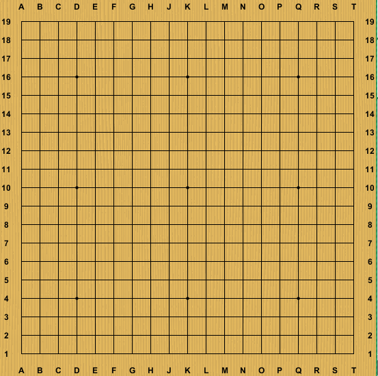
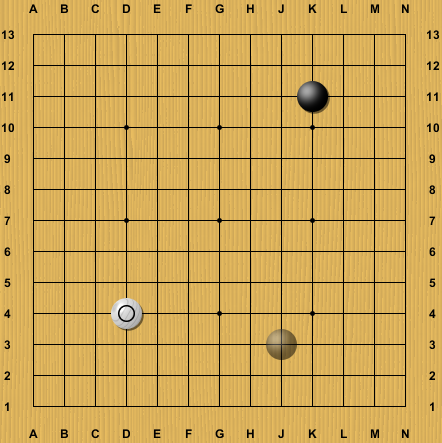
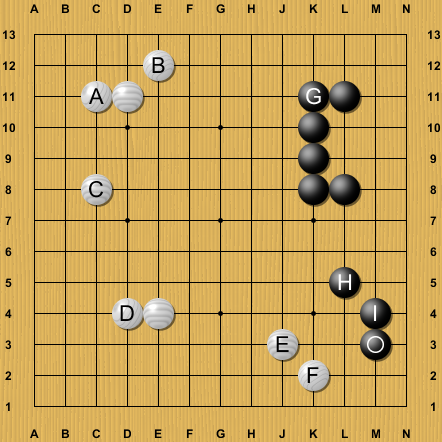
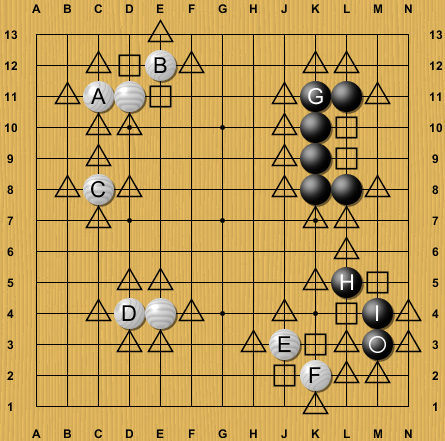
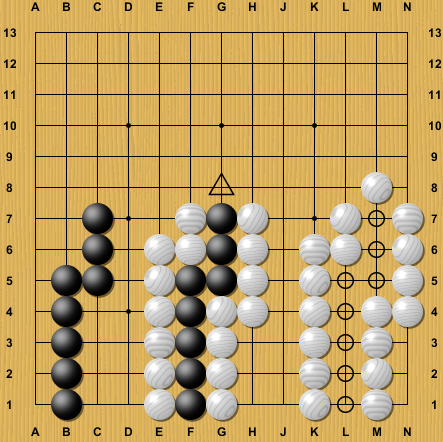
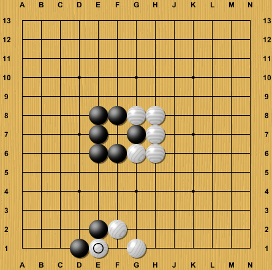

hello_go
========================================================
author: Santiago @ D&A
date: 16 feb 2018
autosize: true

Regla 1
========================================================

Se juega sobre un **tablero** inicialmente vacío, que tiene marcada una **cuadrícula**.

***
 

Regla 2
========================================================

Las **piedras** se sitúan únicamente sobre intersecciones vacías y no se mueven. Los jugadores alternan poniendo una pieza en cada turno, negro, blanco, negro, ...

***
 

Regla 3
========================================================

Las piedras que tienen una piedra adyacente del mismo color siguiendo la cuadrícula forman un **grupo** que es indivisible.

***
 

Regla 4
========================================================

Las intersecciones vacías adyacentes a cada grupo se denominan **libertades**.

***
 

Ejercicio 1: Identificar grupos y contar libertades
========================================================

 

Regla 5
========================================================

Cuando un grupo tiene ocupadas todas sus intersecciones adyacentes por piedras enemigas excepto una, se dice que está en **atari**. Cuando el oponente
ocupa la última libertad, el grupo es **capturado** y retirado del tablero.

***
 

Ejercicio 2: Capturar grupos (ojo con 2c!)
========================================================

 

¡ Eso es todo !
========================================================

En serio, es todo
========================================================

Todo los demás son consecuencias de explorar lo que pasa cuando jugamos siguiendo estas reglas.

El ser humano lleva 3000+ años haciéndolo.

Hasta hace 2000 años se jugaba sencillamente a **"Pierde el primero que no puede poner más piedras."**

Ejercicio 3: Finales antiguos y modernos
========================================================

 

De qué se dieron cuenta hace 2000+ años
========================================================

Se dieron cuenta de una cosa fundamental ...

... llegados al punto en el que el territorio está asignado, todo lo demás es una rutina sin interés. Una pérdida de tiempo, vamos.

Es más, si **contamos el área**, ya sabemos quién gana sin necesidad de jugarlo.

Go es un juego de territorio!
========================================================

**NO** es una regla, es una **CONSECUENCIA** de las reglas.

Cuando ya no se disputa territorio, la partida ha terminado. Se cuenta y en paz.

  1. Se cuenta el área y así no hay que contar las capturas (**reglas chinas**).
  2. O se cuenta el territorio y se compensa la diferencia de capturas (**reglas japonesas**).
  3. Además, si los jugadores están equilibrados, se le da una compensación de 7.5 puntos (llamada **komi**) a blanco porque negro empieza.

Al final, todas las reglas son (casi) lo mismo.

Algo crucial que no nos habíamos detenido a pensar
========================================================

Para poder contar el territorio, necesitamos saber qué está **vivo** (nunca podría llegar a capturarse en una partida) y qué está **muerto** (podría
capturarse, con suficiente experiencia, los jugadores están de acuerdo y no se molestan en capturarlo).

Hay, por lo tanto, diversas formas de vida.

Al final de la partida, ya solamente queda vida incondicional o aburrida. Mientras haya otra cosa, hay algo por lo que pelear.

Diversas formas de vida
========================================================

  * Vida **incondicional**, que no se captura ni jugando solo infinitas veces seguidas.
  * Vida **"aburrida"**, no es totalmente incondicional, pero "todos" saben cómo defenderla. Es algo resuelto.
  * Vida con (o sin) la iniciativa. Los conceptos más importantes en go son **sente** (con la iniciativa) y **gote** (sin la iniciativa). Algo puede
estar vivo y sufrir "amenazas de muerte", o muerto y "amenazar con vivir".
  * **Proyectos de vida**. Grupos o simplemente espacios que tienen (o no) potencial de albergar vida determinando la habilidad de ambos, su estado final
y sobre todo tamaño.
  * No siempre hay que **matar**, a menudo **reducir** es suficiente. A veces la avaricia se castiga con una **invasión**.

Ejercicio 4: Vida incondicional, aburrida, sente y gote
========================================================

 

La última cosa que hay que mencionar: el ko
========================================================

  * Dicen que **ko** significa infinito, debe ser una interpretación libre.
  * Como en muchos juegos, hay que evitar la repetición de posiciones.
  * La recaptura inmediata es ilegal y hay que jugar en otro sitio antes de recapturar.

***

Ejercicio 5: El ko
========================================================

 

El camino del go.
========================================================

A lo tonto, hemos introducido una serie de conceptos: piedras, grupos, libertades, atari, captura, ojos, falsos ojos, vida, formas de vida, komi,
matar, reducir, invadir y ko. Hay fácilmente 50 conceptos importantes y un proverbio:

 * "Si algo tiene nombre, estúdialo."

El camino del go es profundizar más y más los mismos conceptos. A medida que los vamos experimentando, los revisitamos y cada vez los entendemos
de manera más profunda.

El camino del go.
========================================================

A través del esfuerzo intelectual, el go nos hace entender mejor el equilibrio, la eficiencia, la iniciativa, en definitiva nos hace mejores y
por eso ha formado parte de la educación superior en Asia desde el periodo Edo (hace unos 4 siglos) y los términos del go sirven para describir
situaciones en la vida que van más allá del juego.

Bienvenidos al camino del go.
========================================================

